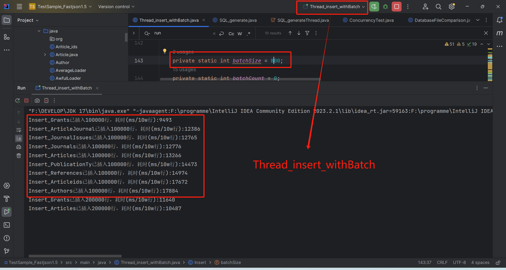

## SUSTech CS307 Database Project1, Fall 2024

#### GROUP：He Jiayang 12213023，Feng Junming 12311031

------
### Member Contributions and Percentage of Effort

**He Jiayang:**

- Database table design
- Data filtering and import using Java
- Framework setup and scripting for data import in Python
- Optimization of Python with multithreading, including comparative testing between disabled and enabled triggers
- Optimization testing across different data volumes
- Writing SQL statements for project-related accuracy checks
- Project report writing

**Feng Junming:**

- Database table design and E-R diagram creation
- Data filtering and import using Java
- Various import optimizations in Java, such as batch processing, multithreading, etc., with comparative analysis
- Data import testing across multiple platforms (macOS, Windows, Linux)
- Comparative import testing on a non-Postgres database (MySQL)
- Project report writing


### Project Source Folder Structure:

```shell
├── src/main/java
│	├─(Class for store the information)
│   │	├─Article.java
|	|	├─Article_ids.java
│	│	├─Author.java
│	│	├─Grant.java
│	│	├─JDate.java
│	│	├─Journal.java
│	│	├─JournalIssue.java
│	│	└─Publication_types.java
│	├─(Class for DatabaseConnect）
│	│	├─DatabaseManipulation.java
│	│	├─FileManipulation.java
│	│	├─SQL_dbConnect.java
│	│	└─SQL_dbConnectMySQL.java
│	├─(Class for DatabaseOperation）
│	│	├─ReadJson.java 
│	│	├─SQL_generate.java
│	│	├─SQL_insert.java
│	│	├─Thread_insert.java 
│	│	├─Thread_insert_withBatch.java
│	│	└─Thread_insert_withBatchV2.java
│	├─(Class for Test）
│	│	├─ConcurrencyTest.java 
│	│	└─DatabaseFileComparison.java
│	└─(Others)
│		└─DataFactory.java
├──SQL
│	└─DDL.sql
│   └─DDLmysql.sql
│   └─no_foreignkey.sql
│   └─disable_triggers.sql
│   └─enable_triggers.sql
│   └─yueshu.sql
├──sql_files
├──pom.xml //file for MAVEN
├──postgresql-42.2.5.jar
├──pubmed24n.ndjson
├──—— pythonscripts
|	|	├─loader_awful.py
│	│	├─loader_best.py
│	│	├─loader_muti.py
│	│	├─sqlGenerator.py
│	│	├─fenli.py
│	│	├─Compare.py
│	│	└─Publication_types.java
│	│	└─Publication_types.java
├──readme.md
├──readme.pdf
└─Photo
```

------

### Task 1: E-R Diagram
Our group used the [Boardmix](https://boardmix.cn/) drawing tool to create the E-R diagram for this project. The screenshot is as follows:


1. **Entities**
   - **Article**: Includes attributes such as `id` and `title` and is associated with Author, Journal, PublicationType, Grant, ArticleId, and Reference.
   
   - **Author**: Contains `id`, `fore_name`, etc., and has a many-to-many relationship with Article and Affiliation.
   
   - **Journal**: Has `id`, `country`, etc., and has a one-to-many or many-to-many relationship with Article.
   
   - **PublicationType**: Contains `id`, `name` and has a many-to-many relationship with Article.
   
   - **Grant**: Includes `id`, `acronym`, etc., and has a many-to-many relationship with Article.
   
   - **ArticleId**: Has `id`, `type` and maintains a one-to-many relationship with Article.
   
   - **Reference**: Has a one-to-many relationship with Article.
   
   - **Affiliation**: Contains `id` and has a many-to-many relationship with Author.

2. **Relationships**
   - Articles have many-to-many relationships with Authors, Publication Types, and Grants through intermediary tables.
   
   - Articles have one-to-many relationships with Journals, Article IDs, and References. Authors and Affiliations also have a many-to-many relationship. 
   
   - These intermediary tables record the association information between related entities, such as the `authors` table, which records the association between articles and authors, and the `publication_types` table, which records the association between articles and publication types.

------

### Task 2: Database Design

The project uses the [`DDL.sql`](DDL.sql) file to create the database tables, written in `DDL` syntax for `PostgreSQL`. (For import into MySQL, the syntax will be adapted to MySQL format as needed.)
  
#### Database Design


Use [`DataGrip`](https://www.jetbrains.com/datagrip/) to create tables and select all of these use `Diagram > Show Diagram` :


#### Design Concept and Explanation

##### Description of Tables and Their Columns

In this project, 12 tables were created. Below is an explanation of each table, its columns, and foreign keys:

### 1. `articles` 
Stores core information about articles.
- **`id`**: Unique identifier for the article, consisting of 1 to 8 digits.
- **`title`**: Full title of the article, required.
- **`pub_model`**: Publication model, such as "Print" or "Electronic".
- **`date_created`**: Article creation date in YYYY-MM-DD format, required.
- **`date_completed`**: Article completion date in YYYY-MM-DD format, optional.

### 2. `journals` 
Stores information about journals.
- **`id`**: Unique identifier for the journal.
- **`country`**: Country where the journal is published.
- **`title`**: Full title of the journal, required.
- **`issn`**: International Standard Serial Number (ISSN), 8 characters.

### 3. `journal_issues` 
Stores volume and issue information for journals.
- **`journal_id`**: Journal ID, referencing the `id` in the `journals` table.
- **`volume`**: Volume number of the journal, optional.
- **`issue`**: Issue number of the journal, optional.
- **`primary key (journal_id, volume, issue)`**: Composite primary key to ensure unique identification for each journal volume and issue.

### 4. `authors` 
Stores information about authors.
- **`id`**: Unique identifier for the author, auto-incremented.
- **`last_name`**: Last name of the author, required.
- **`fore_name`**: First name of the author, default is an empty string.
- **`initials`**: Author's initials, default is an empty string.
- **`collective_name`**: Boolean indicating if it is a collective name, default is `false`.
- **`UNIQUE (last_name, fore_name, initials, collective_name)`**: Ensures each author's information is unique.
### 5. `author_articles` 
Intermediate table representing the many-to-many relationship between `authors` and `articles`.
- **`author_id`**: References the `id` in the `authors` table.
- **`article_id`**: References the `id` in the `articles` table.
- **`PRIMARY KEY (author_id, article_id)`**: Composite primary key to ensure each author-article relationship is unique.

### 6. `article_journals` 
Intermediate table representing the many-to-many relationship between `articles` and `journals`.
- **`article_id`**: References the `id` in the `articles` table.
- **`journal_id`**: References the `id` in the `journals` table.
- **`PRIMARY KEY (article_id, journal_id)`**: Composite primary key to ensure the relationship between each article and journal is unique.

### 7. `affiliations` 
Stores affiliation information for authors.
- **`id`**: Unique identifier for the affiliation, auto-incremented.
- **`author_id`**: References the `id` in the `authors` table.
- **`affiliation`**: Affiliation information, required.
- **`UNIQUE (author_id, affiliation)`**: Ensures each affiliation for an author is unique.

### 8. `keywords` 
Stores keywords associated with articles.
- **`article_id`**: References the `id` in the `articles` table.
- **`keyword`**: Single keyword, required.
- **`PRIMARY KEY (article_id, keyword)`**: Composite primary key to ensure each keyword for an article is unique.

### 9. `publication_types`
Stores publication types associated with articles.
- **`id`**: Unique identifier for the publication type.
- **`article_id`**: References the `id` in the `articles` table.
- **`name`**: Name of the publication type, required.
- **`PRIMARY KEY (id, article_id)`**: Composite primary key to ensure each publication type for an article is unique.

### 10. `grants` 
Stores funding information associated with articles.
- **`grant_id`**: Unique identifier for the grant.
- **`acronym`**: Abbreviation of the grant, optional.
- **`country`**: Country of the grant, optional.
- **`agency`**: Agency providing the grant, required.
- **`article_id`**: References the `id` in the `articles` table.
- **`PRIMARY KEY (agency, article_id)`**: Composite primary key to ensure each funding relationship is unique.

### 11. `article_ids` 
Stores multiple identifiers associated with articles.
- **`article_id`**: References the `id` in the `articles` table.
- **`type`**: Type of identifier, such as "pubmed" or "doi", required.
- **`id`**: Actual identifier value.
- **`PRIMARY KEY (article_id, type, id)`**: Composite primary key to ensure each identifier type for an article is unique.

### 12. `article_references` 
Stores citation information for articles.
- **`article_id`**: References the `id` in the `articles` table.
- **`reference_id`**: ID of the referenced article.
- **`PRIMARY KEY (article_id, reference_id)`**: Composite primary key to ensure each citation is unique.

These tables and their column constraints ensure data integrity and uniqueness across relationships.

##### Database Design Rationale

- **Compliance with Normal Forms**  
  - Each column in every table is indivisible, with only a single value, achieving the first normal form (1NF).
  - Each table has a unique primary key that relates to its entries, ensuring compliance with the second normal form (2NF).
  - Functional dependencies are respected by separating data with transitive relationships into distinct tables, meeting the third normal form (3NF).

- **Project-Specific Requirements**  
  - All tables are structured to avoid circular dependencies, uphold `UNIQUE` constraints where necessary, and facilitate data consistency.

------

### Task 3: Data Import

#### Task 3.1 Basic Requirements
### Script Overview for Database Import

|      Script Name               | Author       | Description                                                                                  |
|:-------------------------------|--------------|----------------------------------------------------------------------------------------------|
| **Readjson.java**              | Feng Junming | Reads each ndjson line, converts it to an SQL statement, and executes it immediately (inefficient). |
| **SQL_Generate.java**          | Feng Junming | Parses ndjson and generates SQL files for 12 database tables.                                |
| **SQL_insert.java**            | Feng Junming | Imports SQL data into PostgreSQL using optimizations like multithreading.                    |
| **Thread_insert_with_Batch.java** | Feng Junming | Reads JSON directly and uses multithreading + batch processing with disabled triggers for PostgreSQL. |
| **Thread_insert.java**         | Feng Junming | Imports JSON data directly into PostgreSQL using multithreading.                             |
| **loader_awful.py**            | He Jiayang   | Reads ndjson line-by-line and executes SQL statements immediately (less efficient).          |
| **loader_muti.py**             | He Jiayang   | Imports pre-generated SQL files with multithreading for moderate efficiency.                 |
| **loader_best.py**             | He Jiayang   | Uses high concurrency, transactions, and prepared statements for optimized importing, applying disabled triggers for PostgreSQL. |

### Process Overview

We first converted JSON data to SQL statements using `SQL_Generate.java`. The Java version of this script was slow, so we later rewrote it in Python as `sqlGenerator.py`, enhancing efficiency with transaction optimization.

To prevent duplication, tables were created with primary keys, unique constraints, but no foreign keys(add foreign keys after finished all insert operations). The "ON CONFLICT DO NOTHING" statement handled deduplication, and foreign keys were reinserted post-import, which proved more efficient than having them defined upfront.

Our final insert script incorporated six optimization methods:
1. Persistent connections
2. Prepared statements
3. Transactions
4. Batch imports
5. Multithreading
6. Trigger disabling during import


**Test Environment**
- **CPU**: AMD Ryzen 5 3500U, 2.10 GHz, 8 GB RAM
- **IDE**: IntelliJ IDEA 2023.2.1 (Community Edition), Memory: 2048M

#### 1. Readjson.java
This is the simplest method, but due to its low efficiency, it won’t be detailed here; explanations of conversion methods are included in the optimized scripts below.  
Execution time: `374.8341` minutes, approximately `6 hours`.

#### 2. SQL_Generate.java

This Java code reads data from a JSON file (`pubmed24n.ndjson`), parses it into Java objects, and generates SQL insert statements to store data into multiple database tables. The process is as follows:

1. **Initialization and Setup**
   - Defines essential classes like `Article` and `Author` and variables for file reading and database connections.
   - Sets the path to the JSON file (`pubmed24n.ndjson`).

2. **File Reading and Data Processing**
   - Reads the JSON file line by line with `BufferedReader`.
   - Parses each line into an `Article` object with `JSON.parseObject`.
   - For each `Article` and related entities (like `Author` and `Journal`), generates corresponding SQL insert statements and writes them to separate `.sql` files.
   - Tracks progress by counting processed lines and printing status periodically.

3. **SQL Statement Generation**
   - Each entity (e.g., `Article`, `Author`, `Journal`) has a specific method for generating SQL insert statements, such as `genSQL_Articles` and `genSQL_Authors`.
   - Escapes single quotes in strings to avoid SQL syntax errors or injection risks.
   - For associative tables (e.g., `author_articles`), retrieves related entity IDs to maintain accurate relationships.

4. **Database Batch Operations**
   - Uses batch execution in methods like `genSQL_AuthorArticles`, where SQL statements are added to a batch and executed when reaching 1,000 statements, reducing database interaction and improving efficiency.

5. **File Writing**
   - The `write_SQL` method writes SQL statements to the appropriate `.sql` files, creating the file if it doesn’t exist, appending statements, and closing the `FileWriter` after flushing.

This code efficiently generates SQL insert files from JSON data, organizing them for future execution in the database to establish relationships across tables.

#### 2. Design and Explanation of the Python Script
   - Similar to the Java script, the Python version optimizes memory and runtime through transaction-based operations, generating SQL files as intermediates for direct data import or integration into a larger data pipeline.

##### Performance Comparison
Results show that `SQL_Generate.java` requires approximately 1,903.90 seconds (about 31.7 minutes) to generate all SQL files, while the optimized Python script completes the task in only 97 seconds.


#### 3. SQL_Insert.java

This script optimizes the batch insertion of data using multithreading and applies pre-generated SQL files for efficiency. The goal is to execute insert statements from these files in parallel and to add foreign key constraints after all data is inserted. Here’s the workflow:

##### `SQL_insert` Class (Main Class)

1. **Initialization and Setup**
   - Records the program’s start time.
   - Establishes a database connection via `SQL_dbConnect`.
   - Sets the task count (`numberOfTasks`) for 12 SQL files (each representing a table such as `articles`, `authors`, `journals`).
   - Creates a `CountDownLatch` to coordinate thread completion.

2. **Launching Threads for SQL File Insertion**
   - Starts 12 `Read_SQL` threads, each responsible for reading and batch inserting data from a specific SQL file (e.g., `author.sql`, `grants.sql`).
   - Each thread reads SQL statements into a list and, once 1,000 statements accumulate, performs a batch insertion with `executeSQLBatch`, clearing the list afterward.

3. **Completing Threads and Adding Foreign Key Constraints**
   - Waits for all threads to complete using `latch.await()`.
   - Defines a list of SQL foreign key constraints (`addKey`) to be added post-insertion.
   - Executes these foreign key constraint statements with `executeSQLBatch`.
   - Records the end time and calculates the total execution time.

##### `Read_SQL` Class (Thread Class)

1. **Initialization**
   - Takes in a `CountDownLatch`, thread name, file name, and `SQL_dbConnect` instance.
   - Sets the path to the specific SQL file.

2. **Thread Execution**
   - The `start` method initiates `run`, which contains the main logic:
     - Reads the SQL file line by line using `BufferedReader`.
     - Collects SQL statements in `sqlStatements` until 1,000 entries are accumulated, then executes a batch insert and clears the list.
     - Once file processing is done, calls `latch.countDown()` to signal task completion.
     - Records and prints the thread’s execution time.

This approach efficiently processes large volumes of SQL data by batch inserting from multiple files through concurrent threads. Foreign key constraints are added post-insertion to maintain data integrity. This design boosts import efficiency, especially for large datasets, a

#### 4. Thread_insert_with_Batch.java

This Java code performs **multithreaded** data reading from a JSON file and **batch inserts** into multiple tables in a PostgreSQL database, adding foreign key constraints after insertion. The main steps are:

##### `Thread_insert_withBatch` Class

1. **Initialization**
   - Sets up database connection parameters (host, database name, username, password, port).
   - Records the program start time.
   - Creates a `CountDownLatch` for thread coordination, setting it to 12 for each insertion task.
   - Calls `getConnection` to establish a database connection.

2. **Launching Insert Threads**
   - Starts 12 `Insert` threads, each handling a specific table (e.g., `Insert_Articles`, `Insert_Journals`). Threads are initialized with the `CountDownLatch`, database connection, and relevant SQL insert templates. Some threads are assigned a higher priority.

3. **Finalizing Threads and Adding Foreign Keys**
   - Uses `latch.await()` to ensure all threads complete.
   - Adds foreign key constraints using SQL statements stored in `addKey`, executed by `executeSQLBatch`.
   - Records and outputs the total execution time.

4. **Database Connection Methods**
   - `getConnection` establishes a connection by loading the PostgreSQL driver and using specified parameters.
   - `executeSQLBatch` sets the connection to non-auto-commit mode, batches SQL statements, executes them, and commits the transaction.
   - `closeConnection` is for closing the connection (not currently used in the code).

##### `Insert` Class (Thread Class)

1. **Initialization**
   - Receives a `CountDownLatch`, database connection, thread name, and SQL insert template.
   - Defines batch variables: `batchSize` (default 1000) and `batchCount`.

2. **Thread Execution**
   - `start` method triggers the `run` method:
     - Reads the JSON file line by line and parses each line into an `Article` object.
     - Calls the relevant `genStatement_*` method based on the thread’s task, setting SQL parameters and adding them to the batch (e.g., `genStatement_Articles`, `genStatement_Journals`).
     - Executes and commits the batch when the batch count reaches the batch size, then resets the batch count.
     - Outputs progress for every 100,000 lines.
     - After file processing, it executes any remaining batch.
     - If `Insert_Authors` completes, it starts `Insert_Affiliations` and `Insert_AuthorArticles` threads to handle tables dependent on auto-incremented IDs from the `Authors` table.

3. **SQL Parameter Generation Methods (`genStatement_*`)**
   - Each `genStatement_*` method extracts and sets parameters from the `Article` object for the relevant table and adds it to the batch, incrementing the batch count. Examples:
     - `genStatement_Articles` sets parameters like article ID, title, publication model, creation date, and completion date.
     - `genStatement_Authors` sets author details like surname, first name, initials, and whether they are a collective author.
   - `getAuthorId` retrieves the correct author ID for relational tables based on the author’s surname.
   - `transferToSqlDate` converts string dates to `java.sql.Date` format for compatibility with SQL date fields.
#### 4. Thread_insert.java

This Java code leverages multithreading to enhance data insertion efficiency, processing article data from a JSON file and dividing it based on table structure and relationships to handle the import process from file to database.

**Note: In testing, this multithreaded method was found to be inefficient and slow, likely due to using nine threads per row without batch insertion, leading to resource contention. As a result, this version may lack data accuracy in terms of foreign keys and integrity. Use with caution.**

##### `Thread_insert` Class (Main Class)

1. **Initialization and Setup**
   - Records the start time.
   - Sets up the JSON file path.
   - Creates a `DataManipulation` object for database operations.
   - Connects to the database (`dm.getConnection()`).

2. **Data Reading and Processing**
   - Reads the JSON file line by line using `BufferedReader`.
   - Parses each line into an `Article` object.
   - For each `Article`, starts nine threads to handle insertions into various tables (e.g., `Thread_add_Atc_Jnl_JnlIs`, `Thread_add_Article_ids`).
   - Every 1,000 records, prints the elapsed time.

3. **Completion**
   - Records the end time, calculates, and prints total records processed and time elapsed.

##### Thread Classes (e.g., `Thread_add_Atc_Jnl_JnlIs`)

1. **Initialization**
   - Accepts `DataManipulation`, `Article`, and other parameters to store for operations.

2. **Execution**
   - Each thread’s `start` method triggers the `run` method, which calls specific data insertion methods (e.g., `add_Article_Journal_JournalIssue`, `add_Article_ids`) to insert data into respective tables.

3. **Data Insertion Methods (e.g., `add_Article_Journal_JournalIssue`)**
   - Extracts relevant data from the `Article` object, formats it, and uses the `DataManipulation` object for insertion. For instance:
     - `add_Article_Journal_JournalIssue`: Combines article and journal details, then calls `dm.addAll`.
     - `add_Article_ids`: Combines article ID and related data, then calls `dm.addArticleIds`.
     - `add_Authors_and_Affiliation`: Inserts author and affiliation data by looping through authors and affiliations and calling `dm.addAuthor`, `dm.addAffiliation`, etc.
     - `add_AuthorArticles`: Retrieves author IDs and associates them with articles in the author-article table using `dm.addAuthorArticles`.
#### Task 3.2 Data Accuracy Checking

As per the report requirements, we provide the number of records in each entity table.

**Main Tables**


**Intermediate Tables Representing Many-to-Many Relationships**


## Task 3.3 Advanced Task

### 3.3.1&2 Find more than one way to import data and provide a comparative analysis of the computational efficiencies between these ways.
#### (1) Multithreading + High-Concurrency Batch Reads in Java

In `Thread_insert_with_Batch.java`, we first use a multithreaded approach to create and start 12 `Insert` threads in batches, each responsible for inserting data into a specific database table, such as `Insert_Articles`, `Insert_Journals`, etc. Each thread is provided with the `CountDownLatch` object, database connection, thread name, and corresponding SQL insert statement template.


For each thread, when the batch size `batchSize = 100`, the read-write speed is approximately 18.733 seconds per 100,000 rows.


For each thread, when the batch size `batchSize = 500`, the average read-write speed is approximately 13.640 seconds per 100,000 rows.


For each thread, when the batch size `batchSize = 800`, the average read-write speed is approximately 13.437 seconds per 100,000 rows.


For each thread, when the batch size `batchSize = 1000`, the average read-write speed is approximately 14.363 seconds per 100,000 rows.

### Code Optimization Considerations

#### Performance Analysis

- **Database Connection Setup**:
  The `getConnection` method currently reloads the PostgreSQL driver every time a `Connection` object is created, causing unnecessary overhead. The driver should be loaded once, ideally at application startup, for more efficient connection handling.

- **Database Operation Improvements**:
  - In the `Insert` class's `run` method, the `addBatch` and `executeBatch` methods are called frequently due to a relatively low `batchSize` of 800, leading to excessive database interactions. Increasing the batch size can reduce access frequency, enhancing performance.
  - The `getAuthorId` method executes a separate `SELECT` query for each author, adding considerable overhead. Implementing a caching mechanism here can minimize query calls and improve efficiency.

#### Optimizing Database Connection Initialization
The PostgreSQL driver should be pre-loaded at class initialization. The `getConnection` method can then retrieve connections using the pre-loaded driver.

### Multithreading + Batch SQL Injection in Java

The process begins with `SQL_Generate.java` generating SQL files for each table, followed by `SQL_insert.java`, which employs 12 threads to handle batch insertion for 12 database tables. Each thread accesses the corresponding SQL file and performs batch inserts.

When the batch count in each thread reaches the defined batch size, the batch is executed and committed to the database, and the count is reset. This approach improves data import efficiency through parallel processing and 


For each thread, when the batch size `batchSize = 100`, the average read-write speed is approximately 31.035 seconds per 100,000 rows.


For each thread, when the batch size `batchSize = 500`, the read-write speed is approximately 28.587 seconds per 100,000 rows.


For each thread, when the batch size `batchSize = 800`, the read-write speed is approximately 29.251 seconds per 100,000 rows.


For each thread, when the batch size `batchSize = 1000`, the read-write speed is approximately 29.776 seconds per 100,000 rows.


### (3) SQL Injection in Python

Notably, the execution efficiency of the Java scripts is significantly lower than that of Python. In Python, we applied several optimization methods, including maintaining a constant connection, using prepared statements, employing transaction mechanisms, batch importing, multithreading optimization, and disabling all triggers during import. These six optimization techniques were implemented.

The first four optimizations were discussed in lab sessions, while the last two were discovered through online research. The relevant test code can be found in `/JavaLoaders/TestLoaders`. For easy comparison, we used the `Buildings` table with 4,706 entries as the reference table for testing.

Python script tests were conducted under the following environment unless otherwise specified:

- **CPU**: 12th Gen Intel Core i7-12700H at 2.30 GHz
- **RAM**: 16.0 GB
- **OS**: Microsoft Windows 11
- **DBMS**: PostgreSQL 16rc1, compiled by Visual C++ build 1936, 64-bit
- **IDE**: PyCharm Professional 2022.2.1
- **Python**: 3.11.10 with psycopg2 version 2.9.9, concurrent.futures, and other necessary packages

As shown in the image below, executing the `loader_best.py` script displays the time required for each SQL file as well as the time needed to reapply constraints.


Using the Python script, the total execution time for all SQL files is:
**1486.52s + 29.60s = 1516.12s ≈ 25.269 minutes**


The insertion of intermediate relationship tables, which involves querying `author_id`, significantly slows down the script. Without this delay, all files could potentially be executed within 6-8 minutes.

### To optimize the script:
- **Reuse Database Connections**: Establish a single database connection at the start of the program and reuse it across all tasks, avoiding the overhead of repeatedly opening and closing connections.

- **Optimize Batch Size**: Adjust the batch size to find an optimal value based on your system’s memory and PostgreSQL’s transaction handling capacity. This can significantly improve performance by reducing the frequency of database interactions.

- **Avoid Repeated Connections in `execute_script`**: The `execute_script` function currently opens a new connection each time it’s called, which may be unnecessary. Modify `execute_script` to accept a reusable connection or to pool connections.

For comparison, the execution times for different Python scripts are as follows:

1. **loader_awful.py** (no optimization): Total execution time = 45.218 minutes.
2. **loader_muti.py** (with multithreading): Total execution time = 37.765 minutes.

### 3.3.2. Try to **optimize your script**, and find **more than one ways** to import data, and provide a comparative analysis of the computational **efficiencies** between these ways.

As mentioned in **3.3.1**, we applied various optimization methods, including maintaining a constant connection, using prepared statements, employing transaction mechanisms, batch importing, multithreading optimization, and disabling all triggers during import, for a total of six techniques.

The first four optimizations were covered in lab sessions, while the last two were sourced from online research. The relevant test code can be found in the attached zip file.

| Import Time Comparison                                                                           |
|--------------------------------------------------------------------------------------------------|
|  |

On the test device:

The chart above shows the results of testing different parameters after multithreading and batch import optimization. The vertical axis represents the execution time per 100,000 SQL statements. The optimized Java scripts use the best-performing parameters:

- **Java Multithreading + High-Concurrency Batch Reads (1)**: `BATCH_SIZE=800`
- **Multithreading + SQL Batch Injection (2)**: `THREADS=12, BATCH_SIZE=500`

All batch import and multithreaded import attempts are listed below:

| insert_sql.java                                                | Thread_insert_with_Batch.java                              |
|----------------------------------------------------------------|------------------------------------------------------------|
|  |  |

As shown, an excessively large or small batch size is less efficient than a moderate batch size, likely due to optimal compatibility with the current hardware setup.

For multithreading, performance initially improves as thread count increases but eventually hits a bottleneck, which may be related to the core count of the SoC in use.

In addition, when importing data with Python, we applied the same six optimizations, with the following results:

Using Python, we implemented three scripts. The first script reads each line of the ndjson file, parses it, and directly executes the corresponding SQL statement. The second script uses `sqlGenerate.py` to read the ndjson file and generate all SQL statements sequentially before executing them. The third script includes all six optimizations (constant connection, prepared statements, transactions, batch importing, multithreading, and disabling triggers during import), achieving a significant performance increase.

**The comparison of the four Java methods and three Python methods is shown in the table below:**

| Language | Initial Time | Only Multithreading | Optimized Time | Best Optimized                                 |
|----------|--------------|---------------------|----------------|------------------------------------------------|
| Java     | 374.834 min  | 399.187 min         | 62.102 min     | 23.176 min (insert_sql.java with optimization) |
| Python   | 45.218 min   | \                   | 37.765 min     | 15.269 min  (loader_best.py)                   |
### Conclusion
- Through debugging and comparison, we implemented the six optimization methods mentioned above, achieving substantial efficiency gains in both the Java and Python scripts.

- We found that simply adding multithreading does not significantly improve script efficiency. In fact, if system disk memory is limited, the large data volume and excessive processes may actually slow down execution.

- To significantly boost efficiency, it is essential to apply other compatible optimization methods alongside multithreading and to carefully control the number of processes and batch size parameters. These adjustments are key to achieving an optimal balance in performance.

- However, I believe there is still room for further optimization due to potential hardware limitations and redundant operations in the current implementation. Nonetheless, the script performance is largely satisfactory.

- In a vertical comparison, we observed that the Python script outperforms the Java script, likely due to effective optimizations within Python’s libraries. Additionally, Python seems to integrate more smoothly with databases, making operations feel more streamlined.

- Ultimately, the best overall import time achieved was 60.723 minutes with the Java script and 25.269 minutes with the Python script.
### Task 4  Compare DBMS with File I/O 

### 4.1 test environment
test device1：

#### a.AMD Ryzen 5 3500U with Radeon Vega Mobile Gfx 2.10 GHz,8.00 GB

#### b.IntelliJ IDEA 2023.2.1 (Community Edition), Memory 2048M
````
import:com.alibaba.fastjson2.JSON; java.io.BufferedReader;
java.io.FileReader;
java.io.IOException;
java.sql.*;
java.text.SimpleDateFormat;
java.util.ArrayList;
java.util.List;
java.util.concurrent.CountDownLatch;
````
pom.xml in the root directory of the project, guide MAVEN to deploy the fastjson2 driver:
````
 <dependencies>
  <dependency>
    <groupId>com.alibaba.fastjson2</groupId>
    <artifactId>fastjson2</artifactId>
    <version>2.0.53</version>
  </dependency>"

````

test device2：

#### a.MacBook Pro 14-inch 2021, Apple M1 Pro, 16GB RAM, 512GB SSD

#### b.macOS Monterey 12.4, Intellij IDEA 2023.1.5, PostgreSQL 16

test device3：

##### a.CPU:	12th Gen Intel Core i7-12700   2.30 GHz
RAM	16.0 GB 

##### b.Microsoft Windows 11 ，Pycharm Professional 2022.2.1


Pycharm Professional 2022.2.1

Python 3.11.10 ,import: psycopg2  version==2.9.9,concurrent.futures,other necessary packages.


#### DBMS: PostgreSQL 16rc1, compiled by Visual C++ build 1936, 64-bit

### Experiment Replication Requirements:
To replicate this experiment, ensure the use of the same IDE, Java JDK version, DBMS version, and operating system. Use matching versions of the PostgreSQL driver and CSVReader class. Specific version details are provided for accuracy in replication.

### Comparing FILE I/O and DBMS Script:

## Data Preloading

We use `readNdJsonData` and `readNdJsonDataArticle` to load 10,000 lines from the ndjson file into two datasets:
- **`data` Dataset**: Contains `JSONObject` types for file I/O operations.
- **`Articles` Dataset**: Stores parsed data as `Article` objects for DBMS operations.

### File I/O with Java(to .txt)

- **`fileInsert`**: Loops through `data`, writing each `JSONObject` to a file using `BufferedWriter`. Outputs operation time after all entries (10,000) are written.
- **`fileQuery`**: Reads data line by line into `Article` objects until 10,000 entries are processed, then outputs time.
- **`fileUpdate`**: Iteratively updates fields in `data`, writes to the file, and outputs the operation time.
- **`fileDelete`**: Uses the `File` class’s `delete` method to remove the file and outputs time.

### DBMS with Java (PostgreSQL)

- **`dbInsert`**: Iterates through `Articles`, preparing `Journal` data and executing with `PreparedStatement`. Outputs time after all entries are inserted.
- **`dbDelete`**: Deletes specific `Journals` data (`id='0000211'`) with a `DELETE` statement and outputs time.
- **`dbQuery`**: Executes a `SELECT` query, reading all results and outputting time.
- **`dbUpdate`**: Runs an `UPDATE` statement on the database and outputs time.

### DBMS with Java (MySQL)

For comparison, we implemented similar insert, delete, query, and update methods in MySQL (`dbInsertMYSQL`, `dbDeleteMYSQL`, etc.), modifying connection commands and database driver as necessary. Execution times were recorded for analysis.

| Experiment Time Comparison Results in Java                                                      |
|------------------------------------------------------------------------------------------------|
|                   |

Here, we compare the results of tasks executed in Java on a Windows 11 system.

According to the experimental results, for insert operations, file-based operations are faster than DBMS-based DDL. This may be due to the relatively small data volume, as file-based operations only require basic I/O, whereas database operations require establishing a connection, which takes time. The DBMS also needs to analyze and parse DDL statements within the memory (SGA), perform necessary operations, and finally write to the database files, which inevitably takes longer than file-based operations.

**For update operations**, 

however, the DBMS outperforms file-based operations. This is likely because file-based updates involve reading, updating, and writing back, which is a longer cycle. For delete operations, the difference is minimal, possibly because the data volume is relatively small. If the data volume were to increase, the repetitive process of reading, deleting, and writing in files would likely be slower than in a DBMS.


### 4.3 Advanced Tasks
### 4.3.1 High Concurrency Test
### Script Description

**Thread Pool and Task Submission**:  
A fixed thread pool is created with `nThreads` using `Executors.newFixedThreadPool(nThreads)`. A `List<Future<Boolean>>`, called `results`, stores each task’s result.

**Submitting Concurrent Tasks**:  
In a loop running 1000 times, tasks are submitted to the pool. Each task calls `performQuery` to execute a database query, returning `true` if successful. Each `Future<Boolean>` is added to the `results` list.

**Shutting Down the Thread Pool and Collecting Results**:  
The thread pool is closed with `executor.shutdown()`, preventing new tasks but allowing ongoing ones to finish. Each `Future` in `results` is checked with `result.get()`, which waits for task completion. If `true`, `successCount` is incremented; otherwise, `failureCount` is incremented. Results are displayed after all tasks finish.

**Database Query Execution (`performQuery` Method)**:  
This method runs the actual database query, creating a PostgreSQL connection and using a `PreparedStatement` to execute `SELECT * FROM articles WHERE id = ?`. If successful, it returns `true`; otherwise, it logs the error and returns `false`.

Testing the database under high concurrency with multithreading helps evaluate performance and stability under high traffic. However, concurrent writes can cause data contention and conflicts, so operations should be managed for consistency and safety.

We set up 1000 select tasks, divided into groups of 100, 200, 300, 400, and 500 threads to test concurrency. Results below:


As shown, concurrency performs well at 100 and 200 threads but fails as thread count increases.

To optimize performance, caching frequently accessed data could reduce database load and improve response time. Maintaining cache consistency is crucial, with synchronous or asynchronous updates to avoid conflicts in high-concurrency scenarios.

### 4.3.2 Comparing Performance Across Platforms

Tests were conducted on:

- macOS + Postgres
- macOS + MySQL
- Windows + MySQL
- Windows + Postgres

For cross-platform evaluation, we tested on **Windows** and **macOS**, and used **Java** and **Python** programming languages.

The test scripts, including **Compare.py**, compare Java and Python I/O and DBMS operations across Windows 11 and macOS. CRUD operations were performed on 10,000 records, specifically targeting the **articles** table defined in **DDL.sql**.

- Detailed results are shown below:

#### 4.3.2.1 Different Operating Systems

| Performance Results with Postgresql and Mysql on Different Operating Systems          |
|---------------------------------------------------------------------------------------| 
|          |

The tests reveal that Windows, with the highest CPU performance, achieved the fastest speeds. Additionally, PostgreSQL consistently outperformed MySQL. Increasing the thread count quickly led the MacBook to a performance ceiling, whereas the Windows machine continued to improve. This difference is attributed to the higher core and thread count available on the Windows desktop CPU.

#### 4.3.2.2 Import Data Using Various Programming Languages (Java, Python)

| Performance Comparison of Different Programming Languages                            |
|---------------------------------------------------------------------------------------| 
|          |

As shown, Python significantly outperforms Java in both file I/O and DBMS operations, achieving higher efficiency across all tasks. This advantage is largely due to Python libraries, such as `psycopg2`, which are optimized for such operations, providing Python with an edge over Java in standard SQL executions.

#### 4.3.2.3 Database Software Comparison: Postgresql vs. Mysql

| Insert Performance Comparison Between Postgresql and Mysql                            |
|---------------------------------------------------------------------------------------| 
|          |

In comparing MySQL and PostgreSQL, PostgreSQL’s object-oriented architecture, with polymorphism and inheritance, enables advanced data modeling and efficient handling of complex queries. Its function and conditional indexing provide an edge in complex query scenarios. Conversely, MySQL excels in read-intensive operations with built-in query caching, which enhances efficiency in query-heavy datasets. However, under high concurrency, PostgreSQL allows multiple CPU cores to boost query efficiency, while MySQL's cache may falter when data volume exceeds cache capacity.

For write-intensive tasks, PostgreSQL’s multi-version concurrency control enables multiple users to perform inserts simultaneously, making it well-suited for high-concurrency environments. MySQL’s internal write-lock mechanism limits concurrency during intensive writes, affecting performance.

Overall, PostgreSQL’s multi-process architecture better supports frequent concurrent writes, while MySQL’s multi-threaded design is advantageous in query-heavy, read-intensive scenarios. PostgreSQL also supports a wider range of data types and flexible attribute additions, beneficial for complex data structures.

In simpler scenarios, MySQL offers an advantage with its indexed-organized tables, optimal for primary key queries. MySQL’s rollback mechanism reduces space usage, avoiding data bloat issues seen with PostgreSQL’s XID-based structure.

## Thank you for reading!
